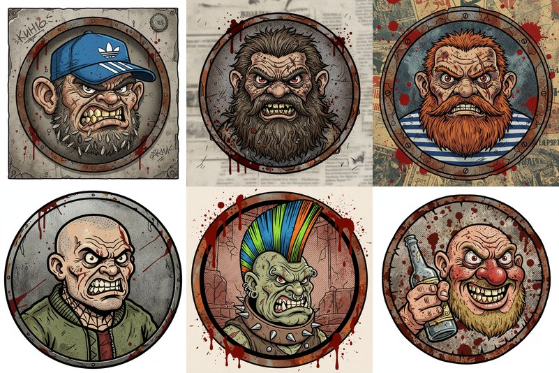

# :boxing_glove: Dwarf Fights

### Post-Soviet courtyard battle royale

A browser-based battle royale where procedurally generated dwarf fighters battle it out on a post-Soviet courtyard basketball court. Gritty trash-realism aesthetic meets arcade action.

---

## Features

- :video_game: **Battle royale with up to 16+ fighters** -- chaotic free-for-all brawls
- :office: **Post-Soviet courtyard arena** -- basketball court with chain-link fence, khrushchyovkas in the background
- :art: **Gritty cartoon sprite fighters** -- gopnik/street style character designs
- :zap: **PixiJS WebGL rendering + Matter.js physics** -- smooth performance with real collision dynamics
- :trophy: **Tournament bracket system** -- structured competition with elimination rounds
- :bar_chart: **Fighter stats, weapons, and archetypes** -- each fighter has unique attributes and fighting style
- :performing_arts: **Procedural name generation and fighter profiles** -- every bout features fresh characters
- :fire: **Rage mechanic prevents stalemates** -- fighters get more dangerous as fights drag on
- :fast_forward: **Adjustable battle speed (0.2x - 5x)** -- watch in slow-mo or blitz through tournaments

## How to Play

1. Open `index.html` in any modern browser, or
2. Visit the live version: [https://vradko.github.io/dwarf-fights/](https://vradko.github.io/dwarf-fights/)

No build tools, no dependencies to install -- just open and play.

## Tech Stack

- **PixiJS v7** -- WebGL/Canvas 2D rendering
- **Matter.js** -- 2D physics engine
- **Vanilla JavaScript** -- no frameworks, no bundlers
- **CSS3** -- UI styling and animations

## License

MIT
